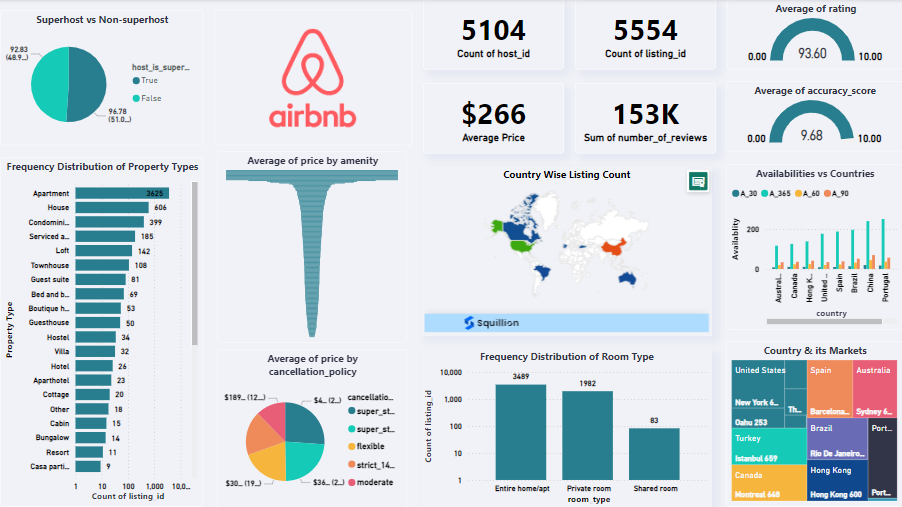

# 🏡 Airbnb Analysis  
**"Unveiling Airbnb Trends: Analyze, Explore, and Visualize with Ease"**  

---  

## 📘 Introduction  
Welcome to the **Airbnb Data Analysis and Visualization Web Application**! 🚀  

This project transforms raw Airbnb data into structured insights. Starting with a JSON dataset, the data undergoes preprocessing, cleaning, and exploratory data analysis (EDA). The processed data is stored in a **MySQL database** and visualized through an interactive **Streamlit web application** powered by **Plotly** for dynamic and engaging visualizations.  

Whether you’re a traveler, a host, or a data enthusiast, this app helps you uncover valuable insights into Airbnb trends!  

---  

## ✨ Features  

Our Airbnb Data Analysis and Visualization web application is divided into three exciting sections:  

### 1️⃣ Discover 🕵️  
Get detailed information about Airbnb listings with just a few clicks:  
- **Input Options:** Choose a country, street, and listing name.  
- **Output Information:**  
  - **Listing Details:** Name, location, description, ratings, reviews, and URL.  
  - **Host Details:** Background information, including superhost status.  
  - **Latest Comments:** Top five recent guest reviews for better insights.  
- Perfect for users seeking detailed information about specific Airbnb properties.  

### 2️⃣ MapQuest 🗺️  
Visualize Airbnb listings on an interactive map:  
- Powered by **Plotly’s MapBox**, this feature provides geospatial visualizations.  
- **Filters Available:**  
  - Property type  
  - Room type  
  - Minimum and maximum nights  
- Ideal for targeted, location-based exploration.  

### 3️⃣ Insights 📊  
Dive deep into Airbnb data trends and patterns:  
- Choose from 8-9 analysis options, such as:  
  - **Property Type Distribution**  
  - **Price Analysis**  
  - **Availability Trends**  
  - **Superhost Analysis**  
  - **Room Type Distribution**  
- Visualizations include **sunburst charts**, **pie charts**, **heatmaps**, and more.  
- Gain a holistic view of the tourism industry and online rental markets.  

---  

## 🌍 Domain  
**Travel Industry, Property Management, and Tourism**  

---  

## 🎓 Skills Takeaway  
- Python Scripting 🐍  
- Data Preprocessing ✂️  
- Data Visualization 🎨  
- Exploratory Data Analysis (EDA) 🔍  
- Streamlit Development 🌐  
- Power BI 

---  

## 🛠️ Technology and Tools  
- **Python 3.12.2**  
- **MySQL**  
- **Streamlit**  
- **Plotly**  
- **Power BI**

---  

## 🚀 Process  

### ✂️ Data Extraction  
- Extracted information from the **2019 Airbnb dataset**, including property details, pricing, location, and reviews.  

### 🔁 Data Preprocessing & Transformation  
- Transformed and cleaned raw data into structured **DataFrames** using Python.  
- Ensured the data was organized and prepared for meaningful analysis.  

### 🗃️ Database Integration  
- Established a connection between Python and MySQL database using **MySQL Connector** via **XAMPP**.  
- Used **SQLAlchemy** for efficient querying and data handling.  

### 📊 Data Visualization and Analysis  
- Designed an interactive **Streamlit dashboard** with engaging **Plotly charts**.  
- Offered geospatial visualizations and insights to help users explore data trends effectively.  

### 📊 Power BI Dashboard 
- Designed an interactive **Power BI dashboard** with engaging **charts**.  
- Offered geospatial visualizations and insights to help users explore data trends effectively.

---  

## 📞 Contact  
- **LinkedIn:** [Rahemath](https://www.linkedin.com/in/rahemath/)  
- **Email:** shaikrahemathds@gmail.com  